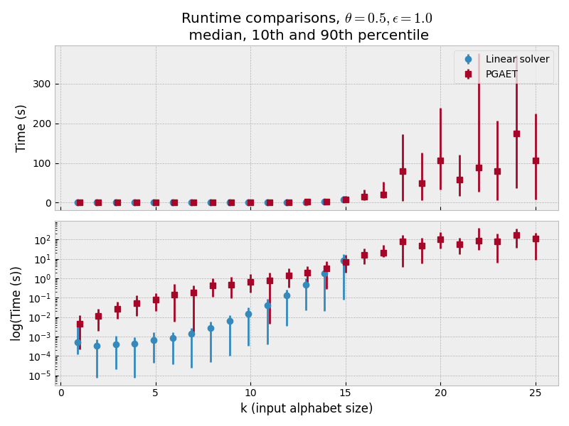
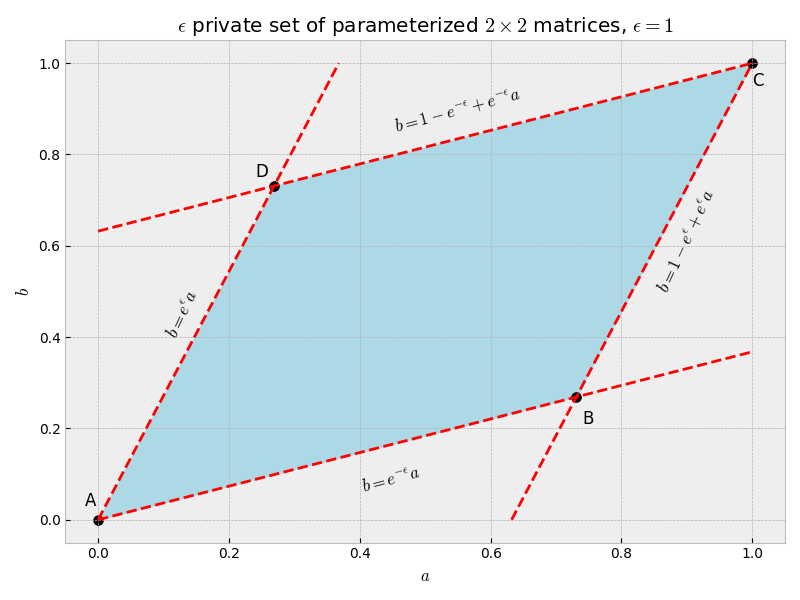
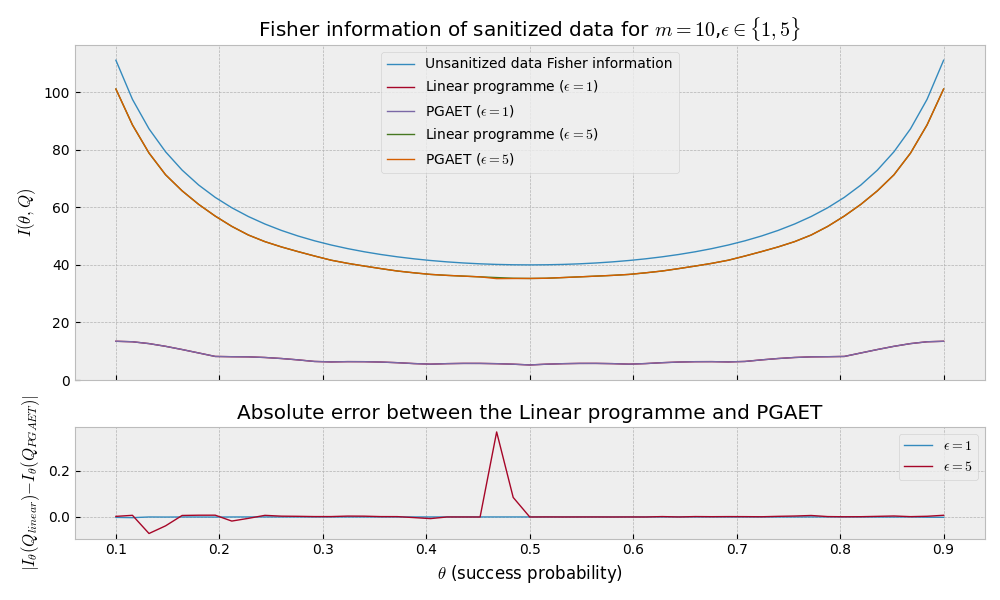
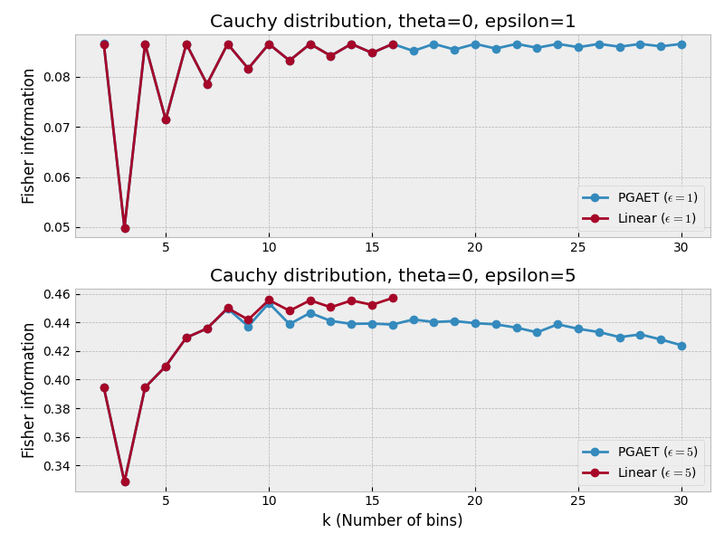

# locally_efficient_differential_privacy

This GitHub repo contains supplementary content related to my Master's thesis titled "Maximizing Fisher Information in $\epsilon$-Differentially Private Mechanisms". The thesis is available on the [official server of University of Vienna](https://utheses.univie.ac.at/detail/74976/).

## Repo structure

Folder `DP` contains individual solvers, utility functions, and a `DP_tester` class, which servers as a wrapper around the plotting code. All solvers are designed as callables; to compute the optimal privatization mechanism one calls `solver(p_theta, p_theta_dot, epsilon, k)`. Currently available solvers are
| Solver | Description |
| ------ | ----------- |
| LinearSolver | Based on Kairouz et al. (2016), finds the optimal matrix as a linear combination of possible extremal structures. Guaranteed exact solution but exponential runtime in the input alphabet dimension $k$ |
| PGA (Projected Gradient Ascent) | Uses gradient ascent updates to find the optimal privatization mechanism, ensuring feasibility through projections. Complexity is $O(k^9)$. |
| PGAET (Projected Gradient Ascent with Edge Traversal) | Similar to PGA but with the addition of boundary mapping. Theoretically should converge faster than PGA. |
| PGA/PGA_edges modified objective | An attempt to improve accuracy and convergence properties with a log barrier function. |
| ScipySolver | Solver that uses scipy's minimize function. This function uses Sequential Least SQuares Programming (SLSQP) Algorithm. Most accurate approximation algorithm but also the most complex (still better than exponential complexity). |

All approximate solvers perform multiple restarts to improve the chances of finding the optimal solution.

Remaining Jupyter notebooks explore various aspects of the solver's performance and accuracy. `cauchy.ipynb` and `thesis_visualization.ipynb` contain a collection of additional visualizations. The `figures` folder contains generated charts, while the `thesis` folder contains the pdf of my master thesis and the associated oral defense slides.

## Summary of results

1. Runtime comparison between the exact `LinearSolver` and approximate `PGAET`. The `LinearSolver` has exponential time complexity $O(2^k)$ in the input alphabet dimension, $|X| = k$, while `PGAET` retains the polynomial profile of $O(k^9)$. 

2. Feasible set visualization: For $|X| = k$ we can visualize the $\epsilon$-differentially private set of matrices. If we write $Q = \begin{pmatrix} a & b \\ 1 - a & 1 - b \end{pmatrix}$ for some $a,b \in [0, 1]$, we obtain:

3. Accuracy comparison between `LinearSolver` and `PGAET`. Defining $p_\theta^k(x) = {k \choose x} \theta^x (1 - \theta)^{k - x}, \quad x \in [0, ..., k]$ we can compute the optimal Fisher Information values for the protected distribution. `PGAET` performs fairly well with some losses of accuracy in lower privacy regimes (higher $\epsilon$).

4. Discretization approach: To address the infinite-dimensional nature of differential privacy mechanisms for continuous priors, we discretize and bin continuous probability distributions to obtain discrete counterparts. We demonstrate this with the Cauchy distribution, comparing both high- and low-privacy regimes. The dimensionality of the input alphabet $|X| = k$ defines the number of bins we consider for the distribution. `PGAET` struggles to achieve optimal mechanisms under low-privacy (high $\epsilon$) conditions in this case.

## Mathematical foundation

### Theory and definitions

Consider the problem of publishing survey data without revealing sensitive information about its participants. Perhaps the most prevalent method of protecting private data is differential privacy. It introduces randomness to the collected datapoints, obfuscating individual information while retaining global properties of the overall dataset.

Formally, differential privacy (DP) is a Markov kernel $Q$ that maps $(X, A)$ measurable space to $(Z, B)$, $Q : (X, A) \to (Z, B)$, sometimes written as $Q : B \times X \to [0,1]$ with the following properties:

1. For every $B_0 \in B$, the map $x \mapsto Q(B_0, x)$ is $A$ measurable
2. For every $x_0 \in X$, the map $B \mapsto Q(B, x_0)$ is a probability measure on $(Y, B).

Given a parameterized private data distribution $X = (X_1, ..., X_n)$ DP generates sanitized (protected) data $Z$ with conditional distribution
$$ Q(A|x) = P(Z \in A| X= x), $$
and the distribution of the sanitized data $Z$ is
$$ [QP_\theta](A) := \int_{X} Q(A|x)P_\theta (dx). $$

Given a value of $\epsilon \in [0, \infty)$ a differential privacy mechanism is said to be $\epsilon$-Locally Differentially Private if
$$ Q(z|x) \leq e^\epsilon \cdot Q(z|x'), \quad \forall z \in Z, x, x' \in X, $$
where $Q(z|x) = P(Z_i = z| X_i = x)$.

In this thesis we focused on the problem of maximizing some utility function of the sanitized (protected) probability distribution. Specifically, we focused on maximizing the Fisher information. If we define
$$ D_\epsilon(X) = \bigcup_{Z, B} \{Q \in M(X \to Z) | Q(A|x) \leq e^\epsilon Q(A|x'), \quad \forall A, x, x' \} $$
to be the set of all $\epsilon$-differentially private mechanisms, we want to find
$$ \sup_{Q \in D_\epsilon (X)} I_\theta(Q) = \sup_{Q \in D_\epsilon (X)} E_\theta \left[ \left( \frac{\partial}{\partial \theta} \log[QP_\theta](Z) \right)^2 \right]. $$
Here $I_\theta(Q)$ is the resulting Fisher information of $\theta$ as a function of the differential privacy mechanism $Q$. $P_\theta$ is a parameterized prior probability distribution, for example Gaussian with $\theta$ being the location (mean $\mu$) parameter.

In general, this is an intractable problem: the optimization domain is infinite-dimensional, and only a few special cases are known to be exactly solvable. We can vastly simplify the problem if we limit the prior distributions to discrete distributions with finite support, i.e. $|X| = k \in \mathbb{N}$. Following Kairouz et al. (2016), it can be shown that, for discrete priors with $|X| = k$, it suffices to restrict the optimization domain to stochastic matrices of size $k \times k$. The sanitized distribution is also discrete, with the support of size at most $k$.
$$
\begin{align*}
D_{\epsilon, k} &= \bigcup_{Z:|Z|=k} \{Q \in M(X \to Z) | Q(A|x) \leq e^\epsilon Q(A|x') \quad \forall A,x,x'\} \\
&= \{Q \in [0, 1]^{k\times k} | \sum_{i=1}^k Q_{ij} = 1, Q_{ij} \leq e^\epsilon Q_{ij} \quad \forall i,j,j'\}.
\end{align*} \\
$$

The optimization problem becomes 
$$ \max_{Q \in D_{\epsilon, k}} I_\theta(Q) = \max_{Q\in D_{\epsilon, k}} \sum_{z \in Z} \frac{(\sum_{x \in X} Q(z|x) \dot{p}_\theta(x))^2}{\sum_{x\in X} Q(z|x) p_\theta(x)} = \max_{Q\in D_{\epsilon, k}} \sum_{z \in Z} \frac{(Q_z \cdot \dot{p}_\theta)^2}{Q_z \cdot p_\theta}. $$ 

### Useful properties of the maximization problem

1. The objective function, $I_\theta(Q)$ is a convex function in $Q$ (Steinberger (2024), Lemma 4.5).

*Proof*

Notice that $I_\theta(Q) = \sum_{z \in Z} \frac{(Q_z \cdot \dot{p}_\theta)^2}{Q_z \cdot p_\theta} = \sum_{z\in Z} g_\theta(Q_z)$. This means we just need to show that $g_\theta(Q_z)$ is convex. If $Q_z$ is a null vector we have $g_\theta(\lambda Q_1 + (1-\lambda) Q_2) = \lambda g_\theta(Q_1) + (1-\lambda) g_\theta(Q_2)$. Otherwise, $Q_z \cdot p_\theta$ is a positive quantity (both $Q_z$ and $p_\theta$ are probability distributions) we consider
$$
g_\theta(\lambda Q_1 + (1 - \lambda) Q_2) = \frac{(\lambda Q_1 \cdot \dot{p}_\theta + (1-\lambda) Q_2 \cdot \dot{p}_\theta)^2}{\lambda Q_1 \dot p_\theta + (1-\lambda) Q_2 \cdot p_\theta}.
$$

Label $a = Q_1 \cdot \dot{p}_\theta$, $b = Q_2 \cdot \dot{p}_\theta$, $x = Q_1 \cdot \dot{p}_\theta$, $y = Q_2 \cdot \dot{p}_\theta$ (note that $x, y \geq 0$) to get
$$ \frac{(\lambda a + (1-\lambda)b)^2}{\lambda x + (1 - \lambda) y} \leq \lambda \frac{a^2}{x} + (1-\lambda) \frac{b^2}{y}. $$
Expand the square and multiply both sides by $\lambda x + (1 - \lambda)y$ to obtain $2ab \leq a^2 \frac{y}{x} + b^2 \frac{x}{y}$. Define $h(a) := a^2 \frac{y}{x} + b^2 {x}{y} - 2ab$ - we want to show that $h(a) \geq 0$ for all $a \in \mathbb{R}$. We have $h'(a) = 2a\frac{y}{x} - 2b$ and $h''(a) = 2 \frac{y}{x} > 0$ so $h$ is strictly convex and therefore $g_\theta(Q_z)$ is convex.

2. The optimization domain, $D_{\epsilon, k}$ is convex.

*Proof*

Consider two $\epsilon$-locally differentially private mechanisms $Q_1$ and $Q_2$, acting on an input alphabet of size $k$. Then they both have to satisfy $Q_1(z|x) \leq e^\epsilon Q_1(z|x')$ and $Q_2(z|x) \leq e^\epsilon Q_2(z|x')$. Their linear combination $\lambda Q_1 + (1 - \lambda) Q_2 = Q'$ is a matrix of the same size, and element wise we have
$$ Q'(z|x) = \lambda Q_1(z|x) + (1 - \lambda) Q_2(z|x) \leq \lambda e^\epsilon Q_1(z|x') + (1 - \lambda) e^\epsilon Q_2(z|x') = e^\epsilon Q'(z|x'). $$
In fact, the constraining set is a highdimensional polytope (which makes it obviously convex as well). 

3. The output alphabet size is at most the input alphabet size, i.e. $|Z| \leq |X|$. For all $z\in Z$ and $x,x' \in X$ (Kairouz et al. (2016), Theorem 2).
$$ |\ln \frac{Q*(z|x)}{Q*(y|x*)}| \in \{0,\epsilon\} $$
where $Q*$ denotes the solution to the maximization problem.

### Linear solver

Kairouz et al. (2016) observed that the optimal $\epsilon$-differentially private mechanism will be a matrix satisfying the extremal structure of $ |\ln \frac{Q*(z|x)}{Q*(y|x*)}| \in \{0,\epsilon\} $. They construct a so called *Staircase Pattern Matrix* that contains all possible combinations of $1$ and $e^\epsilon$ values, e.g.
$$ S^{(2)} = \begin{pmatrix} 1 & 1 & e^\epsilon & e^\epsilon \\ 1 & e^\epsilon & 1 & e^\epsilon \end{pmatrix}. $$
Any optimal mechanism (also called staircase mechanism) can be represented through the pattern matrix as $Q^T = S^{(k)} \Theta$ where $\Theta = diag(\theta)$ is a $2^k \times 2^k$ diagonal matrix and $\theta$ is a $2^k$-dimensional vector representing the scaling of the columns of $S^{(k)}.

The optimization problem can be formulated then as
$$
\begin{align*}
\max_{\theta \in \mathbb{R}^{2^k}} & \sum_{j=1}^{2^k} \mu (S_j^{(k)}) \theta_j = \mu^T \theta \\
\text{subject to } &S^{(k)} \theta = \mathbb{1} \\
&\theta \geq 0
\end{align*}
$$
and the optimal privatization matrix is obtained as $Q^T = S^{(k)} \Theta$.

### Projected Gradient Ascent

The objective function depends on the mechanism $Q$ and is given by
$$ I_\theta(Q) = \sum_{z\in Z} \frac{(Q_z \cdot \dot{p_\theta}(x))^2}{Q_z \cdot p_\theta}. $$
The gradient of the objective function is given by
$$ \nabla I_\theta (Q) |_{(x,z)} = 2\dot{p}_\theta (x) \frac{Q_z \cdot \dot{p}_\theta}{Q_z \cdot p_\theta} - p_\theta(x) \frac{(Q_z \cdot \dot{p}_\theta)^2}{(Q_z \cdot p_\theta)^2}. $$
Gradient ascent update rule is given by
$$ Q_{t+1} = P(Q_t + \lambda_t \nabla I_\theta (Q_t)), $$
where $P(Q) = \argmin \{||Q - W||_F : W \in D_\epsilon\}$ is the projection subroutine, $||.||_F$ is the Frobenius norm.

